## 🚀 Result at a Glance

| Metric | Performance / Outcome |
| :--- | :--- |
| **Accuracy** | **99.6%** on industrial casting dataset |
| **Efficiency** | **16x smaller** than ResNet18 (4MB vs 64MB) |
| **Reliability** | Verified with **Grad-CAM**|
| **Deployment** | Optimized for **Real-time Edge devices** |

### 🏭 Industrial Impact
* **Cost Efficiency:** Cuts manual inspection time through automation.
* **Scalability:** Built for high-speed production lines.
* **Hardware Friendly:** Runs on low-power CPUs/Edge devices (no expensive GPUs needed).
> [!NOTE]
> That project focused on model development and evaluation. Deployment in a real-time system is planned for future work.

### 🛠️ Tech Stack
* **Framework:** `PyTorch`
* **Computer Vision & Visualization:** `Albumentations`, `OpenCV`, `Grad-CAM`, `TensorBoard`
* **Core:** `NumPy`, `Scikit-learn`, `OS`

---

## 1. Problem Statement

### Overview
Manual quality control in casting suffers often from:
* **Human Factor:** Fatigue, subjectivity, and inconsistent defect detection.
* **Scalability:** On high-speed production lines, humans physically cannot inspect every single part.
* **Cost:** Maintaining 24/7 manual inspection is a high operational cost.

**Goal:** Build a Computer Vision system to classify parts as "OK" or "Defective" while balancing high accuracy and low resource consumption.

---

## 2. Dataset

* **Source:** [Casting Product Dataset on Kaggle](https://www.kaggle.com/datasets/ravirajsinh45/real-life-industrial-dataset-of-casting-product/data)
* **Content:** 1,300 images of top-view of submersible pump impeller.
* **Classes:**

    * **Defective** (Casting defects like blow holes, pinholes, burr, shrinkage defects, mould material defects, pouring metal defects, metallurgical defects, etc.).

    * **OK** (Clean, defect-free products)
* **Environment:** Captured under stable industrial lighting, but includes challenges such as varying orientations and different types of casting flaws.

* **Dataset constraints:** Small and imbalanced, which makes model training challenging.
* **Solution:** To prevent overfitting and improve generalization, **extensive data augmentation** was applied, including:

    * Random rotations and horizontal/vertical flips.
    * Brightness and contrast adjustments.
    * Perspective transforms to simulate camera positioning variances.

> [!NOTE]
> Small and imbalanced datasets are very common in real-world industrial settings, making these techniques directly relevant for practical deployment.  

---

## 3. Technical Approach

The project implements a full end-to-end pipeline for automated defect detection, covering everything from raw data processing to deep model interpretability.

### 1. Custom Dataset & Data Engineering
A robust `Dataset` class was engineered in PyTorch to handle the specific needs of industrial imagery:
* **Dynamic Loading:** Efficient memory management for high-resolution casting images.
* **Extensive Augmentation:** To combat the small dataset size, I implemented a pipeline including random rotations, flips, and color jittering to simulate varying factory floor conditions.
* **Balanced Sampling:** Strategic shuffling and batching to ensure the model doesn't develop a bias toward "OK" products.

### 2. Model Architectures
Two distinct philosophies were compared to find the industrial "sweet spot":
* **ResNet18 (The Benchmark):** A pre-trained industry-standard architecture. While it provides a high-accuracy baseline, its size (**64.5 MB**) presents challenges for edge-device deployment.
* **Custom CNN (The Optimized Solution):** **Lightweight CNN** built using ResNet-style skip connections.
    * **Features:** Utilizes **Skip Connections** and **Residual Blocks** to ensure smooth gradient flow.
    * **Efficiency:** Optimized to a compact **4 MB**, making it 16x smaller than ResNet18 while maintaining competitive performance.
    * **Design:** Specifically tuned to capture subtle casting flaws without the overhead of massive parameters.

### 3. Training & Regularization
* **Optimization:** Used Binary Cross-Entropy loss incorporating a **`pos_weight` parameter** to handle class imbalance. Used **Adam optimizer** for stable convergence and faster training.
* **Regularization & Generalization:** Given the relatively small dataset size, I applied a multi-layered regularization strategy to prevent overfitting:
    * **Dropout Layers:** To de-activate neurons randomly during training, forcing the network to learn robust, non-redundant features.
    * **Weight Decay (L2 Regularization):** To penalize large weights and maintain a simpler, more generalizable model.
    * **Data Augmentation:** To synthetically expand the training variety, ensuring the models don't just "memorize" the limited training set.

### 4. Evaluation & Interpretability
* **Performance Analysis:** Evaluation was conducted using **Confusion Matrices** to look beyond simple accuracy. This allowed for a detailed breakdown of classification errors, specifically identifying **False Negatives**.
* **Explainable AI (Grad-CAM):** Integrated Heatmaps to verify that the model is actually looking at **defects** (cracks, holes) rather than background noise or lighting artifacts.
* **Trade-off Analysis:** A final comparison of model size vs. inference speed vs. accuracy to determine the best candidate for production.

---

## 4. Development Journey

The development of the automated defect detection system was an **iterative process**, guided by careful observation, experimentation, and analysis of model behavior. Each step involved evaluating both **quantitative performance** and **qualitative interpretability** to ensure the model not only achieved high accuracy but also correctly learned to identify casting defects.

### 🔷 Step 1: Baseline Augmentation

Due to the **small size of the dataset**, I implemented a dynamic augmentation pipeline. The transformations are applied **on-the-fly during training**, meaning that the model encounters a different variation of the same image in every epoch. This approach helps the model generalize better and prevents early overfitting.

**Implemented Augmentations (Albumentations):**
* **Spatial Transforms:** `HorizontalFlip`, `VerticalFlip`, `Rotate` (15° limit), and `Affine` (translation and scaling) were used to make the model invariant to the orientation and position of the casting.
* **Pixel-level Transforms:** `RandomBrightnessContrast` and `GaussNoise` (p=0.2) were added to simulate varying lighting conditions and sensor noise in a production environment.

**Original Image Example:**

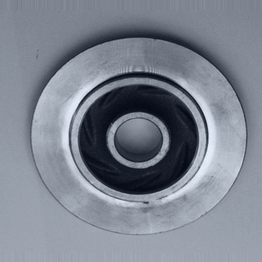

**Augmented Image Examples (Dynamic Variations):**

   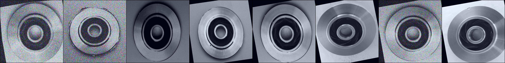

### 🔷 Step 2: Custom CNN (v1)

The first approach was to design a lightweight CNN from scratch. To keep the description clean, the architecture follows a consistent modular pattern:

**Core Logic:**
* **Residual Block:** Every stage begins with a "Downsampling Block" (stride 2) to reduce spatial dimensions, followed by "Identity Blocks" to refine features.
* **Skip Connections:** All blocks use residual connections to improve gradient flow.

**Architecture Specification:**
* **Stem:** $5 \times 5$ Conv (stride 2) $\rightarrow$ BN $\rightarrow$ ReLU ($3 \rightarrow 16$ channels).
* **Stage 0:** 2 blocks ($16 \rightarrow 32$ channels).
* **Stage 1:** 3 blocks ($32 \rightarrow 64$ channels).

**Training & Results:**
* **Learning Rate:** $5 \cdot 10^{-4}$ | **Epochs:** 50
* **Test Accuracy:** **99.6%**

### 🔷 Step 3: Transfer Learning with ResNet18

Benchmarked against **ResNet18** (ImageNet weights) across two experimental phases:

**Phase A: Feature Extraction**
* **Approach:** All backbone layers were **frozen**; only the classification head was trained.
* **Parameters:** 50 epochs, LR: $5 \cdot 10^{-4}$
* **Result:** **96% Accuracy**.
* **Observation:** Freezing the layers limited the model's ability to adapt to the specific textures of casting defects and the heavy augmentation pipeline.

**Phase B: Full Fine-tuning**
* **Approach:** All layers were **unfrozen** for end-to-end training.
* **Parameters:** Lowered LR: $1 \cdot 10^{-5}$ to preserve pretrained features while fine-tuning.
* **Result:** **100% Accuracy**.

### 🔷 Step 4: Interpretability Check (Grad-CAM Visualization)

To verify the reliability of the high accuracy scores, I applied **Grad-CAM** to visualize the models' attention regions. This qualitative analysis was crucial to distinguish between true learning and potential overfitting.

**Results:**
* **ResNet18:** The attention was precisely localized on the defect regions. This confirmed that the model was genuinely identifying casting flaws rather than memorizing background artifacts.

  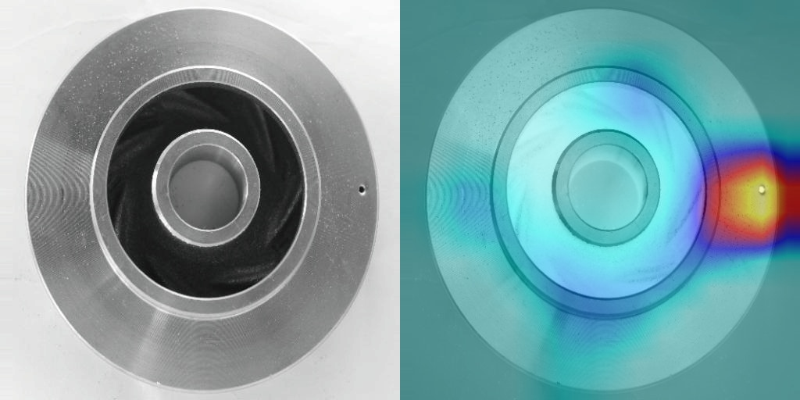

* **Custom Model (v1):** Despite the high accuracy (99.6%), the attention was **scattered and unfocused**. The model was not looking at the defects, indicating a form of underfitting where the architecture lacked the capacity to extract the correct features.

  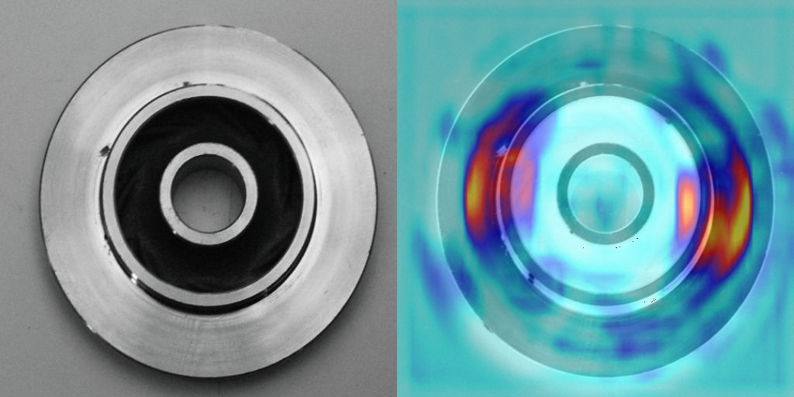

**Decision:**
The visualization revealed that the custom model had not truly learned the defect patterns. This insight directly guided the next stage: adjusting the architecture to increase its feature-extraction capabilities.

### Step 5: Scaling the Architecture (Custom CNN v2)

Following the insights from Grad-CAM, I decided to increase the model's capacity to help it capture more complex defect patterns.

**Changes:**
* **Increased Depth:** Added **Stage 2** consisting of 4 Residual Blocks.
* **Channel Expansion:** Transitioned from $64 \rightarrow 128$ channels (first block with stride 2).
* **Training Strategy:** Extended to 140 epochs. Starting from this model, I implemented a **Learning Rate Scheduler** (StepLR) to fine-tune weights as training progressed, beginning with a base LR of $5 \cdot 10^{-4}$. To ensure better convergence in the later stages, the **LR was reduced to $1 \cdot 10^{-5}$ after epoch 75**.

**Outcome:**
* **Test Accuracy:** **100%**
* **The Reality Check:** Despite the perfect score, **Grad-CAM visualizations** showed the model was focusing on irrelevant regions rather than the defects themselves.

  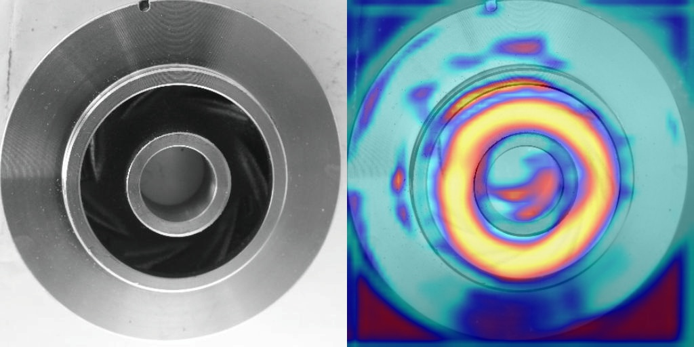

**Key Insight:**
This was a clear case of **overfitting**. Simply increasing the model size and training time allowed the network to "memorize" the dataset environment. This confirmed that raw capacity does not guarantee correct feature learning; the focus needed to shift toward **regularization**.

### 🔷 Step 6: Advanced Augmentation (Custom CNN v3)

To combat the persistent overfitting observed in the previous stage, I significantly increased the complexity of the data augmentation pipeline. The goal was to force the model to focus on localized defect features rather than global image patterns.

**New Augmentation Layers (Albumentations):**
* **Geometry:** `RandomResizedCrop` — implemented to make the model invariant to scale and slight shifts in framing.
* **Lighting & Gamma:** Used `OneOf` blocks to stochastically apply `RandomBrightnessContrast` or `RandomGamma`.
* **Noise & Blur:** Introduced `OneOf` blocks for `GaussNoise` and `GaussianBlur` to simulate sensor degradation and focus inconsistencies.
* **Regularization:** Applied `CoarseDropout` (Cutout) to randomly mask small rectangular regions, forcing the model to find alternative features for classification.

   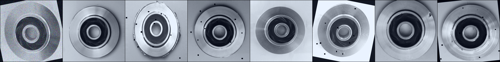

**Outcome:**
* **Test Accuracy:** **100%**
* **Analysis:** Despite the heavy regularization and aggressive noise, **Grad-CAM visualizations** revealed that the model's attention remained centered and failed to precisely lock onto the actual defect regions.

   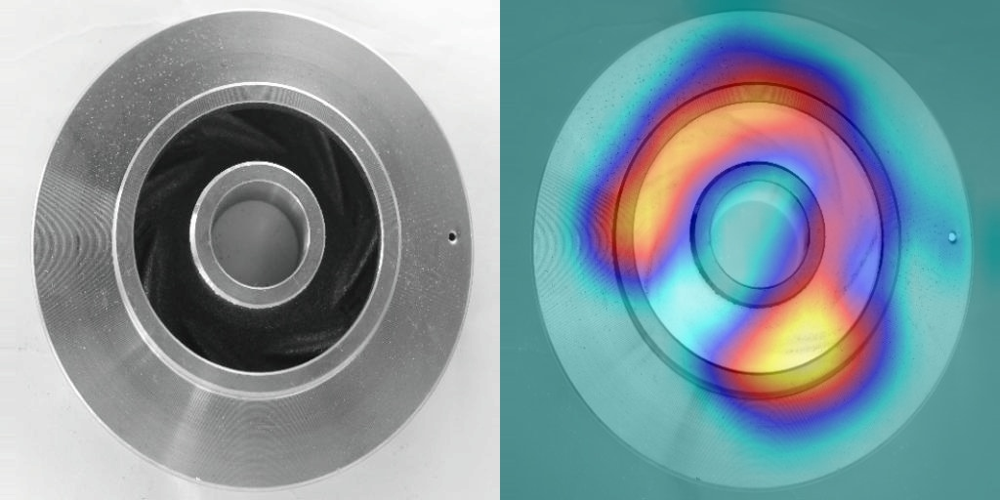

**Insight:**
Even with advanced augmentation, the increased depth of the custom architecture (v2/v3) seemed to lead the model toward memorizing the dataset's "center-heavy" bias. This persistent overfitting signaled that the issue might lie in the architecture's balance.

### 🔷 Step 7: Architecture Downscaling & Regularization (Custom CNN v4)

After observing persistent overfitting in larger models, I tested a **"Slim" approach**. The hypothesis was that a significantly smaller model, combined with stronger regularization, would be forced to learn only the most essential features.

**Structural Changes:**
* **Capacity Reduction:** Removed **Stage 2** entirely and reduced both **Stage 0** and **Stage 1** to just 2 blocks each.
* **Regularization:** Integrated **Dropout** layers and **Weight Decay** to further penalize complexity.

**Revised Training Strategy:**
* **Epochs:** Reduced to 110.
* **Learning Rate:** Started with a more conservative $1 \cdot 10^{-4}$.
* **LR Schedule:** Reduced to $1 \cdot 10^{-5}$ after **epoch 55**.

**Outcome:**
* **Test Accuracy:** **95%**
* **Analysis:** Grad-CAM visualizations showed scattered and unstable attention patterns.

  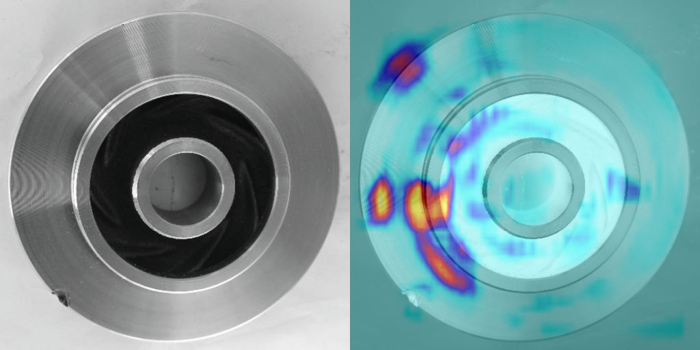

* **Conclusion:** The excessive downscaling caused a **bottleneck effect**. The architecture lacked the necessary depth to extract subtle, high-resolution features, making it difficult to distinguish specific defect patterns from background noise. This clear visualization of model ambiguity guided the decision for the final architecture adjustment.

### 🔷 Step 8: Final Architecture (Optimal Balance)

The final iteration was designed to combine the depth of the larger models with the spatial precision required for accurate defect localization. By adjusting the downsampling strategy and maintaining aggressive regularization, I achieved the most stable and interpretable results.

**Final Architecture Specification:**
* **Stem:** $3 \times 3$ Conv (stride 2) $\rightarrow$ BN $\rightarrow$ ReLU ($3 \rightarrow 16$ channels).
* **Stage 0:** 2 blocks (**stride 1**; $16 \rightarrow 32$ channels). *Note: Stride 1 was used here to preserve high-resolution spatial features early in the network.*
* **Stage 1:** 2 blocks (stride 2; $32 \rightarrow 64$ channels).
* **Stage 2:** 2 blocks (stride 2; $64 \rightarrow 128$ channels).

**Regularization & Training:**
* **Techniques:** Integrated **Dropout**, **Weight Decay**, and `pos_weight` in the loss function to handle class imbalance.
* **Augmentation:** Maintained the extensive pipeline from Step 6 (CoarseDropout, Noise, Blurs).
* **Schedule:** 125 epochs. Started with $1 \cdot 10^{-4}$ learning rate. The **LR scheduler reduced the learning rate to $1 \cdot 10^{-5}$ after epoch 75** to ensure stable convergence.

**Outcome:**
* **Performance:** Only **one misclassification** on the entire test set.
* **Interpretability:** Grad-CAM confirmed that the model now focuses **precisely on the defect regions** with high confidence and sharp localization.

   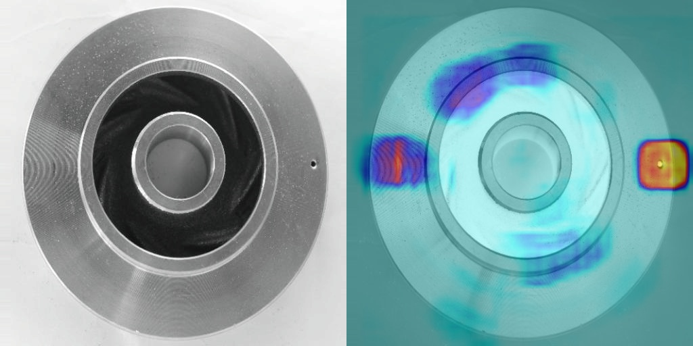
    
   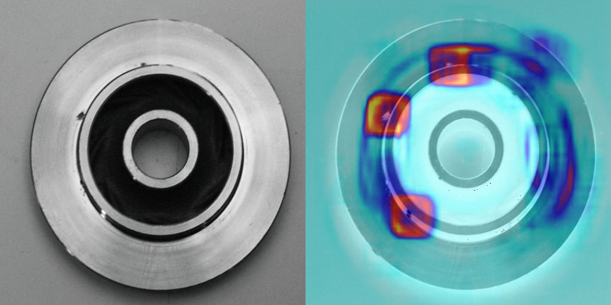

**Critical Observation (False Negative Analysis):**
Upon manual inspection of the single misclassified test image, I discovered a discrepancy: 
* **Dataset Label:** Marked as "Defective".
* **Model Prediction:** Classified as "Normal".
* **Visual Reality:** The image contains **no visible casting defects**. 

This indicates that the model's "error" was actually a correct identification of a mislabeled sample. It confirms that the system has moved beyond memorizing labels and has instead developed a robust understanding of true defect patterns, aligning more closely with human visual logic than with noise in the dataset's ground truth.

   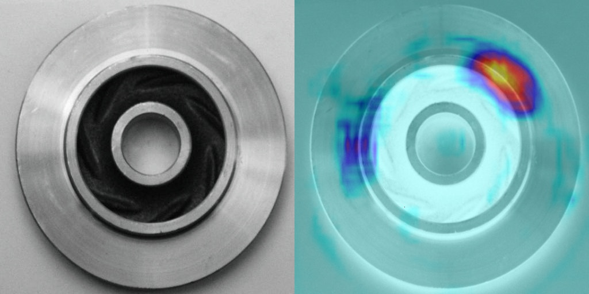

---

## 5. Performance Summary

The final comparison shows that the **Custom CNN** achieves industrial-grade performance while remaining significantly more efficient than the standard **ResNet18** baseline.

### Comparative Analysis

| Metric | ResNet18 (Baseline) | Custom CNN (Final) | Difference |
| :--- | :--- | :--- | :--- |
| **Test Accuracy** | 100% | 99.6% | ~Same |
| **Total Parameters** | 11.17M | **0.69M** | **16x smaller** |
| **Trained Model Size (.pth)** | 64.5 MB | **4 MB** | **16x lighter** |
| **Visual Logic** | Correct (Defect-focused) | Correct (Defect-focused) | Identical quality |
| **Computational Cost** | High | **Low** | Optimized for Edge |

### Key Observations

* **Computational Efficiency:** While both models successfully learned to identify defects (confirmed by Grad-CAM diagnostics), the Custom CNN achieves this with only **0.69M parameters**. This makes it much more suitable for integration into low-power industrial cameras or real-time monitoring systems.
* **Robustness vs. Noise:** Both architectures proved resilient and focused on actual defect morphology rather than background artifacts. The slight difference in accuracy (0.4%) is attributed to the Custom CNN's more rigid generalization.
* **Production Ready:** The massive reduction in disk space (**4 MB vs 64.5 MB**) allows for faster deployment, easier updates over-the-air (OTA), and significantly lower memory overhead during inference.

---

## 6. Key Takeaways

* **Interpretability is Essential:** High accuracy can be deceptive if the model is focusing on the wrong features. Using **Grad-CAM** was the most critical tool in this project—it allowed me to move beyond surface-level metrics and ensure the model was learning actual defect morphology.
* **Balanced Architecture over Model Size:** Industrial tasks don't always require deep networks. Simply increasing depth led to overfitting; the best results came from a **tailored, moderately sized architecture** where spatial resolution was preserved in early layers.
* **Holistic Regularization Strategy:** On specialized datasets, a combination of **diverse augmentation** (like `CoarseDropout` and `Noise`), `Weight Decay`, and `pos_weight` is vital to prevent the model from "memorizing" the background environment.
* **Beyond Ground Truth:** A single misclassification isn't always a failure. Manual inspection of **False Negatives** revealed that the model correctly identified a mislabeled "Normal" image, demonstrating robustness and alignment with real-world human judgment.
* **Systematic Iteration:** The final result was achieved through a **documented, step-by-step refinement** process. Testing specific hypotheses about learning rates, schedulers, and architecture proved more effective than broad hyperparameter tuning.

---

## 7. Next Steps

This project serves as a robust foundation for automated industrial quality control. To move from a research prototype to a production-ready system, the following directions are proposed:

### 1. Deployment
* **Web Integration:** Developing a lightweight web interface (using FastAPI/Streamlit) to allow real-time image uploads and instant defect classification.

### 2. Hybrid Localization Pipeline (CNN + YOLO Cascade)
To improve both precision and computational efficiency, I propose a two-stage inspection workflow:
* **Stage 1 (Filtering):** The lightweight **Custom CNN** acts as a high-speed gatekeeper, identifying whether a part is "Normal" or "Defective."
* **Stage 2 (Localization):** Only if a part is flagged as defective, a **YOLO-based object detection** model is triggered to draw precise bounding boxes around specific flaws.
* **Evaluation:** A comparative study will be conducted to measure the trade-offs between a standalone YOLO model versus this **CNN-YOLO cascade** in terms of latency (ms/image) and industrial practicality.

---

> **P.S.** Full source code, training scripts, and comprehensive visualization logs are available in this repository for reference; the **Custom CNN** weights are included here, while the **ResNet18** model can be found at [this link](https://drive.google.com/file/d/12v_llowvkEUnrz8_rUohmBaaeAPk7aOG/view?usp=drive_link).
